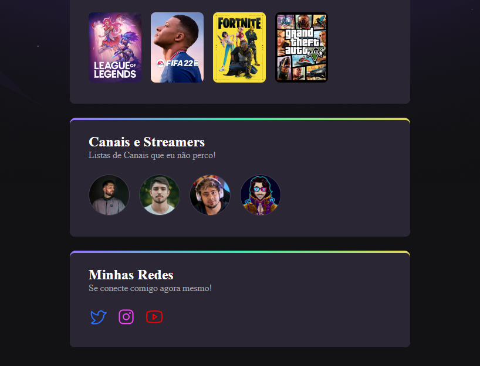

# NLW Esports - Trilha Explorer

Projeto construído do evento Nextel Level Week da RocketSeat

🔗  [Clique aqui para acessar](https//:lopesmtt.github.io/NLW-Esports/)

## 😎 Tecnologias 

- HTML 
- CSS
- GIT e GITHUB

# O que aprendi 

- Utilização do :hover para dar movimento, juntamente com o Transform e o Transition, dando efeito visual de "pulso".

- Animation 
Utilização do animation, usando o @keyframes dando um efeito animado de cima para baixo e de baixo para cima ao acessar a página. 

# 💛 Contato 
- matheusllopes22@gmail.com
- @lopesmtt